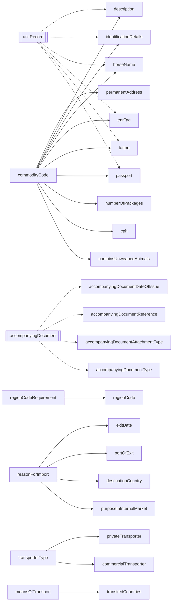
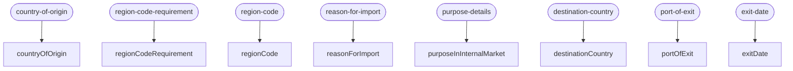
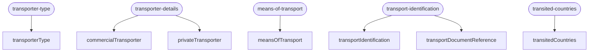
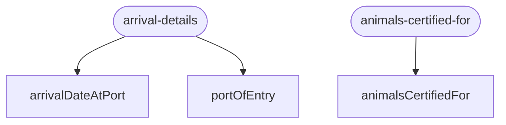
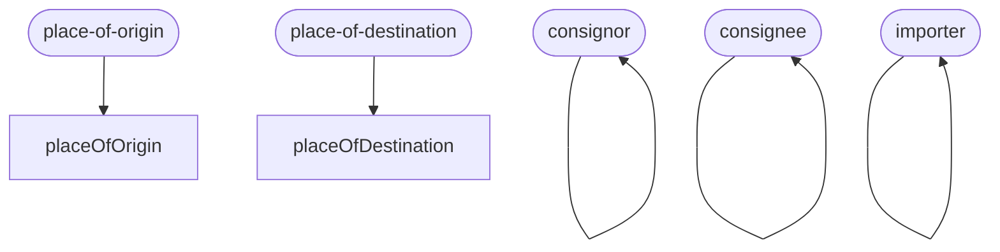
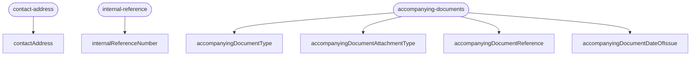

# MODEL.md — obligations model at a glance

Auto-generated from the manifest by `docs/generate-model.js`.
DO NOT EDIT — run `npm run docs:model` to regenerate.

Baseline SHA: `c6d944fc00d8` (sha256 of manifest + helpers + flow)

## 1. Data dictionary

| Name                               | ID         | Within        | Status      | Helper         | Dependencies          | Notes            |
| ---------------------------------- | ---------- | ------------- | ----------- | -------------- | --------------------- | ---------------- |
| commodityLine                      | `20e5f607` | —             | —           | structural     | —                     | structural       |
| unitRecord                         | `385d6e7f` | commodityLine | —           | structural     | —                     | structural       |
| accompanyingDocument               | `52210b3b` | —             | —           | structural     | —                     | structural       |
| poApprovedReferenceNumber          | `9a0b1c2d` | —             | mandatory   | —              | —                     | system-populated |
| responsiblePersonForLoad           | `ab0c1d2e` | —             | mandatory   | —              | —                     | system-populated |
| countryOfOrigin                    | `a01b2c3d` | —             | mandatory   | —              | —                     |                  |
| regionCodeRequirement              | `b12c3d4e` | —             | mandatory   | —              | —                     |                  |
| regionCode                         | `c23d4e5f` | —             | conditional | equalsGate     | regionCodeRequirement |                  |
| reasonForImport                    | `d34e5f6a` | —             | mandatory   | —              | —                     |                  |
| purposeInInternalMarket            | `e45f6a7b` | —             | mandatory   | equalsGate     | reasonForImport       |                  |
| destinationCountry                 | `f56a7b8c` | —             | mandatory   | includesGate   | reasonForImport       |                  |
| portOfExit                         | `a67b8c9d` | —             | mandatory   | includesGate   | reasonForImport       |                  |
| exitDate                           | `b78c9d0e` | —             | mandatory   | equalsGate     | reasonForImport       |                  |
| containsUnweanedAnimals            | `01a2b3c4` | —             | mandatory   | anyAllowListed | commodityCode         |                  |
| placeOfOrigin                      | `89c0d1e2` | —             | mandatory   | —              | —                     |                  |
| consignor                          | `9ad1e2f3` | —             | mandatory   | —              | —                     |                  |
| consignee                          | `abe2f3a4` | —             | mandatory   | —              | —                     |                  |
| importer                           | `bcf3a4b5` | —             | mandatory   | —              | —                     |                  |
| placeOfDestination                 | `cd04b5c6` | —             | mandatory   | —              | —                     |                  |
| transporterType                    | `34d5e6f7` | —             | mandatory   | —              | —                     |                  |
| commercialTransporter              | `de15c6d7` | —             | mandatory   | equalsGate     | transporterType       |                  |
| privateTransporter                 | `ef26d7e8` | —             | mandatory   | equalsGate     | transporterType       |                  |
| meansOfTransport                   | `45e6f7a8` | —             | mandatory   | —              | —                     |                  |
| transportIdentification            | `56f7a8b9` | —             | mandatory   | —              | —                     |                  |
| transportDocumentReference         | `67a8b9c0` | —             | mandatory   | —              | —                     |                  |
| transitedCountries                 | `78b9c0d1` | —             | optional    | includesGate   | meansOfTransport      |                  |
| arrivalDateAtPort                  | `12b3c4d5` | —             | mandatory   | —              | —                     |                  |
| portOfEntry                        | `23c4d5e6` | —             | mandatory   | —              | —                     |                  |
| contactAddress                     | `f037e8f9` | —             | mandatory   | —              | —                     |                  |
| internalReferenceNumber            | `10e5f607` | —             | optional    | —              | —                     |                  |
| animalsCertifiedFor                | `274c5d6e` | —             | mandatory   | —              | —                     |                  |
| cph                                | `263b4c5d` | —             | mandatory   | anyAllowListed | commodityCode         |                  |
| accompanyingDocumentType           | `4fdce1f7` | —             | optional    | —              | —                     |                  |
| accompanyingDocumentAttachmentType | `50ede208` | —             | optional    | —              | —                     |                  |
| accompanyingDocumentReference      | `51fef319` | —             | optional    | —              | —                     |                  |
| accompanyingDocumentDateOfIssue    | `5210042a` | —             | optional    | —              | —                     |                  |
| commodityCode                      | `21f60718` | commodityLine | mandatory   | —              | —                     |                  |
| commodityType                      | `22071829` | commodityLine | mandatory   | —              | —                     |                  |
| species                            | `2318293a` | commodityLine | mandatory   | —              | —                     |                  |
| numberOfAnimals                    | `24192a3b` | commodityLine | mandatory   | —              | —                     |                  |
| numberOfPackages                   | `252a3b4c` | commodityLine | optional    | allowListed    | commodityCode         |                  |
| passport                           | `39657a80` | unitRecord    | optional    | allowListed    | commodityCode         |                  |
| tattoo                             | `3a768b91` | unitRecord    | optional    | allowListed    | commodityCode         |                  |
| earTag                             | `3b879ca2` | unitRecord    | optional    | allowListed    | commodityCode         |                  |
| horseName                          | `3c98adb3` | unitRecord    | optional    | allowListed    | commodityCode         |                  |
| identificationDetails              | `3da9bec4` | unitRecord    | optional    | notInUnionOf   | commodityCode         |                  |
| description                        | `3ebacfd5` | unitRecord    | optional    | notInUnionOf   | commodityCode         |                  |
| permanentAddress                   | `3fcbd0e6` | unitRecord    | mandatory   | allowListed    | commodityCode         |                  |

## 2. Dependency graph

Solid edges (`-->`) are gate reads (an obligation whose `applyTo`
closure reads the source obligation's stored value). Dotted edges
(`-.->`) are group-level invariants — `requires.anyOfIds`
("at least one of these leaves must be filled per instance") or
`requires.allOrNothingOfIds` ("either all listed scalar members are
filled or none are"). Group containers use `[[name]]` shape.

## 3. Page → obligations flow

One Mermaid block per top-level section. Page nodes use stadium
shape `([name])`; edges point from page to each presented
obligation (both `presents` and `presentsForEach`).

### origin-and-reason

### transporter

### arrival

### trader-details

### references

### commodity-lines

```mermaid
graph TD
  commodity-lines-intro([commodity-lines-intro])
  commodity-details([commodity-details])
  commodity-type([commodity-type])
  species-details([species-details])
  number-of-animals([number-of-animals])
  number-of-packages([number-of-packages])
  permanent-address([permanent-address])
  passport([passport])
  tattoo([tattoo])
  ear-tag([ear-tag])
  horse-name([horse-name])
  identification-details([identification-details])
  description([description])
  cph([cph])
  contains-unweaned-animals([contains-unweaned-animals])
  commodity-details --> commodityCode
  commodity-type --> commodityType
  species-details --> species
  number-of-animals --> numberOfAnimals
  number-of-packages --> numberOfPackages
  permanent-address --> permanentAddress
  passport --> passport
  tattoo --> tattoo
  ear-tag --> earTag
  horse-name --> horseName
  identification-details --> identificationDetails
  description --> description
  cph --> cph
  contains-unweaned-animals --> containsUnweanedAnimals
```

